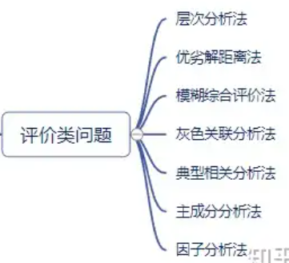

# 算法

## 优化问题

### 线性规划

- 三要素
  
  - 决策变量 $x_i$
  - 目标函数 $\max{z}$
  - 约束条件 数量小于变量的等式
- 标准形式
  
  - $$
    \max z = \sum_{j=1}^{n} c_j x_j
    $$
    
    $$
    \text{s.t. }
    \begin{cases}
    \sum_{j=1}^{n} a_{ij} x_j = b_i, & i = 1,2,\dots,m \\
    x_j \geq 0, & j = 1,2,\dots,n
    \end{cases}
    $$
    
    即
    
    $$
    \max \quad \mathbf{c}^T \mathbf{x}
    $$
    
    $$
    \text{s.t.} \quad 
    \begin{cases}
    \mathbf{A} \mathbf{x} = \mathbf{b} \\
    \mathbf{x} \geq \mathbf{0}
    \end{cases}
    $$
- 标准形式的特征
  
  - 常数项与决策变量非负，系数无要求
  - 约束条件是等式
  - 目标函数是\max
- 非标准形式可以转为标准形式

单纯形法与对偶理论

### 整数规划

### 牛顿法

用于求解无约束优化问题，通过二阶导数加速收敛

### 动态规划

### 多目标规划

## 预测问题

### 差值预测

### 时序分析 ARIMA

### 线性回归

### 多项式回归

### 马尔科夫



# 机器学习

## 回归 有监督

### 岭回归

学习如何通过正则化防止过拟合。

### Lasso回归

学习Lasso回归的原理和实现方法。

## 分类 有监督

### 决策树

### 支持向量机 SVM

### K近邻 KNN

## 聚类 无监督

### K-means

### 层次聚类

## 降维 无监督

### PCA

### t-SNE

# 可视化

# 代码经验

## 可视化

### 设置字体为中文

```python
#设置全局宇体为中文
plt.rcParams ['font.sans-serif'] = ['SimHei']
#使用 SimHei 字体
plt.rcParams ['axes.unicode_minus'] = False
#正确显示负号
```

